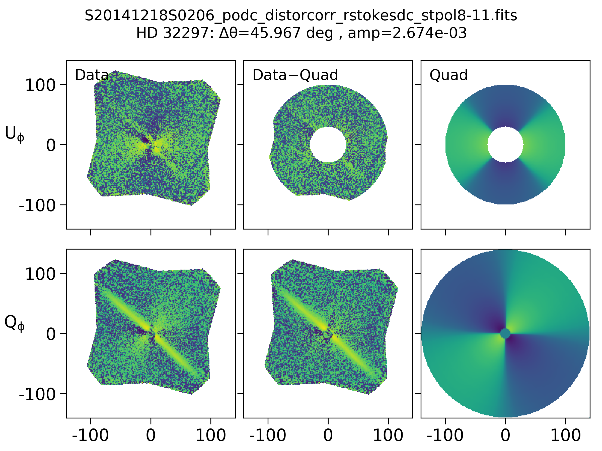

# gpi_pol
Collection of tools to reduce and manipulate Gemini Planet Imager (GPI) polarimetric data

### Instrumental polarization subtraction from radial Stokes cubes
pol_tools.py contains the function `remove_quadrupole_rstokes` that will subtract residual instrumental polarization signal from existing radial Stokes cubes (e.g., "...\_rstokesdc.fits") created with the GPI Data Reduction Pipeline (https://github.com/geminiplanetimager/gpi_pipeline).

Its usage is fairly straightforward: pass it a relative path to an rstokesdc.fits file and it will fit a quadrupole function (scaled by the radial profile of the total intensity, by default) to the U_phi slice. It subtracts the best-fit quadrupole from U_phi, and then rotates a copy of that quadrupole by 45 deg before subtracting it from the Q_phi slice. If `save=True`, it saves the corrected cube as "[input_rstokesdc_name]\_quadsub.fits" along with a PNG of a figure showing the before, after, and best-fit quadrupole.

The basic quadrupole function has the form S = (10^C)\*sin(2\*(theta + dtheta)) with only two tunable parameters: the rotation angle dtheta and the log of the amplitude C. You supply values for them via input arguments `dtheta0` and `C0`, either as initial guesses for the fit, or (if `do_fit=False`) as the values that manually define the quadrupole to subtract.

Descriptions of the optional arguments and other features can be found in the code comments.

#### *Example Usage*
Assume we start with an rstokesdc file "S20141218S0206_podc_distorcorr_rstokesdc_stpol8-11.fits" that has a strong instrumental pol signal in Q_phi that we would like to remove.

We feed that file into the function with some initial guesses for dtheta0 (in radians) and C0 (as a log10 exponent), and then get out a corrected radial Stokes cube:
remove_quadrupole_rstokes(path_fn="S20141218S0206_podc_distorcorr_rstokesdc_stpol8-11.fits", dtheta0=np.radians(60), C0=-4, do_fit=True, save=True)

Here's an example before/after figure that gets plotted. It shows the input data on the left, the corrected output data in the middle, and the best-fit quadrupole function on the right. The top row is the U_phi channel, where the fitting occurs, and the bottom is Q_phi, which is usually the scientifically important channel. The circular gray region around the star is excluded from the fit because it typically contains other noise. The radius of this region can be changed with the input argument `rin` (given in pixels), as can the outer radius that is included in the fit with argument `rout`.

### Other functions in pol_tools

There are additional functions in pol_tools that have various levels of effectiveness. See the function preambles and code comments for explanations of their use. These include:
* `remove_skypol_podc` will subtract sky polarization (e.g., in twilight observations) from individual polarization datacubes ("podc"). This works fairly reliably.
* `remove_persistence_raw_pol` will remove detector persistence from raw polarization images, often caused by observation of a bright star in spectroscopic mode immediately prior to the polarization observation. This requires a reference frame for the persistence signal, typically a dark frame taken immediately before the polarization sequence started. Results from this function are mixed and often requires manual tuning on each image. However, it has been used to mitigate persistence signal in the final radial Stokes images for several datasets.
